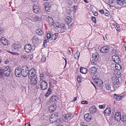
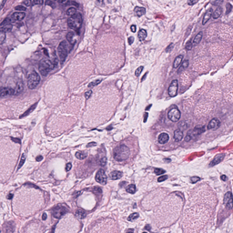
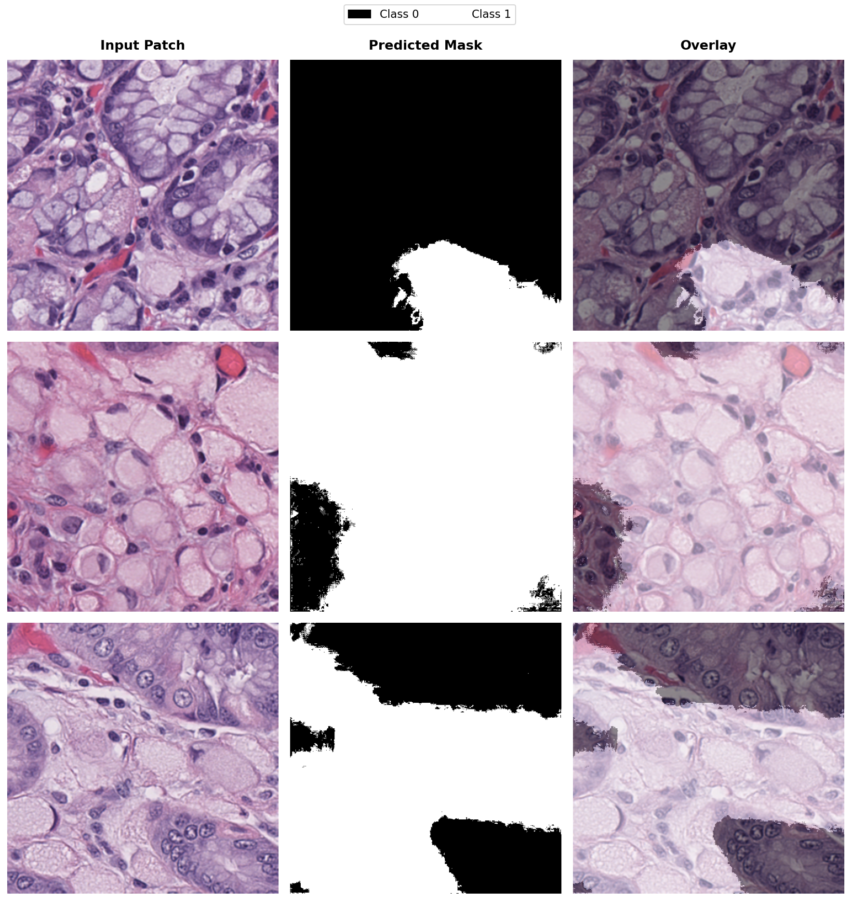

# 🔬 SegFramework — Semantic Segmentation for Medical & Histopathology Imaging

> A modular, production-ready deep learning framework for pixel-level image segmentation — supporting CNN and Transformer architectures with a unified training pipeline.

[](https://www.python.org/)
[](https://pytorch.org/)
[](LICENSE)
[](#implemented-models)

---

## What is Semantic Segmentation?

Semantic segmentation is a pixel-level image analysis task where each pixel in an image is assigned to a specific class label. Unlike image classification, semantic segmentation identifies the exact spatial regions corresponding to objects or tissues within the image.

### Binary Segmentation (2-Class)

Binary segmentation separates the image into two classes: foreground and background

Example: Tumor vs non-tumor tissue segmentation. 

### Multi-Class Segmentation (3-Class or More)

Multi-class segmentation assigns each pixel to one of multiple categories.

Example: Tumor, non-tumor, and background

This enables detailed tissue or object-level understanding within complex images.


| Task | Description | Example |
|---|---|---|
| **Binary (2-class)** | Foreground vs. background | Tumor vs. non-tumor |
| **Multi-class (≥3)** | Multiple tissue or object categories | Tumor · non-tumor · background |

---

## Signet Ring Cell Region Detection

The following images show semantic segmentation for signet ring cell (SRC) carcinoma region detection from histopathology whole-slide images. Signet ring cells are characterized by mucin-filled cytoplasm and displaced nuclei, making precise localization important for pathological assessment and disease characterization.

The segmentation framework enables pixel-level identification of SRC regions using annotated binary masks and deep learning-based semantic segmentation models.

## Framework Pipeline

### Input
- RGB image size: `512 × 512`
- Ground truth annotation:
  - Binary mask
  - Pixel-wise segmentation mask
  - Mask pixel values: integer class indices (`0`, `1`, `2`, ...)
 
## Input

| RGB Image | Ground Truth Mask |
|:---------:|:-----------------:|
|  |  |
|  |  |
 
### Output
- Predicted segmentation mask
- Pixel-level classification map

| Predicted Segmentation Mask |
|:--------------------------:|
|  |

--- 

## Implemented Models

| # | Architecture | Type | Notes |
|---|---|---|---|
| 1 | **U-Net** | CNN | Classic encoder-decoder with skip connections |
| 2 | **Attention U-Net** | CNN + Attention | Gated attention on skip connections |
| 3 | **nnU-Net** | CNN | Self-configuring baseline |
| 4 | **SegNet** | CNN | Encoder-decoder with max-pooling indices |
| 5 | **UNet++** | CNN | Nested dense skip connections |
| 6 | **SegFormer** | Transformer | Hierarchical ViT with lightweight decoder |
| 7 | **SwinUNet** | Transformer | Pure Swin Transformer U-shaped network |
| 8 | **TransUNet** | Hybrid | CNN encoder + Transformer bottleneck |

---

## Key Features

- ✅ Binary and multi-class segmentation
- ✅ CNN and Transformer architecture support
- ✅ Modular plug-and-play model registry
- ✅ YAML-driven configuration - no code changes to switch models
- ✅ Joint image + mask augmentation pipeline
- ✅ Comprehensive pixel-wise evaluation metrics (IoU, Dice, Pixel Accuracy)
- ✅ K-fold cross-validation with structured logging
- ✅ GPU training with checkpoint save/resume
- ✅ Inference mode (no ground-truth required)

---

## Applications

- Medical image segmentation
- Histopathology analysis
- Tumor region detection
- Organ segmentation
- Biomedical image analysis
- General computer vision tasks

--- 

## Project Structure

```
seg_framework/
├── configs/                        ← Per-model YAML configurations
│   ├── unet.yaml
│   └── segformer.yaml
│
├── datasets/
│   ├── images/                     ← Input images (.jpg .png .tif)
│   └── ground_truths/              ← Masks with matching filenames (integer class indices)
│
├── modules/
│   ├── __init__.py                 ← MODEL_REGISTRY + get_model()
│   ├── unet/
│   │   └── model.py
│   └── segformer/
│       └── model.py
│
├── utils/
│   ├── augmentations.py            ← Joint image+mask augmentations
│   ├── config.py                   ← load_config(), ConfigDict, validation
│   ├── dataset.py                  ← SegmentationDataset + build_dataloaders()
│   ├── logger.py                   ← Console/file logger + CSVLogger
│   ├── metrics.py                  ← IoU, Dice, Pixel Accuracy, MetricTracker
│   └── train_utils.py              ← Loss functions and training utilities
│
├── logs/
│   └── <model>_<dataset>/
│       └── <timestamp>/
│           ├── fold_1/
│           │   ├── checkpoints/
│           │   ├── metrics.csv
│           │   ├── model_fold1.log
│           │   └── test_results.csv
│           ├── fold_2/ … fold_5/
│           └── summary.csv         ← Per-epoch metrics across all folds
│
├── train.py
├── test.py
├── infer.py
├── requirements.txt
└── README.md
```

---

## Quick Start

### 1. Install Dependencies

```bash
pip install -r requirements.txt
```

Or  

```bash 
conda env create -f environment.yml
conda activate seg_framework
```

### 2. Organise Your Data

```
datasets/images/          →  image001.png  image002.png  ...
datasets/ground_truths/   →  image001.png  image002.png  ...
```

> ⚠️ Mask filenames must match their corresponding image filenames exactly.  
> Pixel values should be integer class indices: `0, 1, 2, ...`

### 3. Configure

Edit `configs/unet.yaml`. Key fields:

| Field | Description |
|---|---|
| `model.n_classes` | Number of segmentation classes |
| `model.n_channels` | Input channels (`3` = RGB) |
| `training.loss` | `cross_entropy`, `dice`, or `dice_ce` |
| `training.learning_rate` | Initial learning rate |
| `dataset.augment` | `true` to enable joint augmentations |
| `logging.log_dir` | Directory for logs and checkpoints |

### 4. Train

```bash
# Train with U-Net
python train.py --config configs/unet.yaml

# Train with SegFormer
python train.py --config configs/segformer.yaml

# Resume from a checkpoint
python train.py --config configs/unet.yaml \
    --resume logs/unet_dataset/checkpoints/best_model.pth

# Specify GPU device
python train.py --config configs/unet.yaml --device cuda:1
```

### 5. Evaluate

```bash
# Standard evaluation (Pixel Accuracy, Mean IoU, Dice)
python test.py --config configs/unet.yaml \
    --checkpoint logs/unet_dataset/checkpoints/best_model.pth

# Save predicted mask PNGs
python test.py --config configs/unet.yaml \
    --checkpoint logs/unet_dataset/checkpoints/best_model.pth \
    --save_preds --output_dir outputs/predictions

# Inference only — no ground-truth needed
python test.py --config configs/unet.yaml \
    --checkpoint logs/unet_dataset/checkpoints/best_model.pth \
    --images_dir /path/to/test/images \
    --save_preds
```

---

## Configuration Reference

### Loss Functions

| Value | Description | Best For |
|---|---|---|
| `cross_entropy` | Standard pixel-wise cross-entropy | Balanced classes |
| `dice` | Soft Dice loss | Small structures |
| `dice_ce` | Dice + Cross-Entropy combined | **Recommended** for imbalanced classes |

### Optimizers

| Value | Notes |
|---|---|
| `adam` | Default; reliable general-purpose choice |
| `adamw` | Adam with decoupled weight decay; good for Transformers |
| `sgd` | Requires `optimizer.momentum`; often better final accuracy |

### Schedulers

| Value | Notes |
|---|---|
| `cosine` | `CosineAnnealingLR` — use with Adam/AdamW |
| `step` | `StepLR` — configure `step_size` and `gamma` |
| `plateau` | `ReduceLROnPlateau` — good with SGD |

---

## Augmentations

Enable per-config with `dataset.augment: true`. Applied to the **training split only**.

| Transform | Default Probability |
|---|---|
| Horizontal flip | `p = 0.5` |
| Vertical flip | `p = 0.3` |
| Random rotation ±15° | `p = 0.4` |
| Random crop + resize | `scale = (0.75, 1.0)`, `p = 0.4` |
| Color jitter (brightness/contrast/saturation/hue) | configurable |
| Gaussian blur | `radius = 1.0`, `p = 0.2` |

> Custom augmentations can be added to `utils/augmentations.py` by subclassing `JointTransform`.

---

## Adding a New Model

Only **6 steps** — `train.py` and `test.py` require **zero modifications**.

```
Step 1  modules/<model>/<model>_model.py    →  Define MyModel(nn.Module)
Step 2  modules/<model>/<model>_parts.py   →  Building blocks (optional)
Step 3  modules/__init__.py                →  Add "mymodel": MyModel to MODEL_REGISTRY
Step 4  process/<model>/<model>.py         →  class MyModelProcess(BaseProcess): pass
Step 5  process/__init__.py                →  Add "mymodel": MyModelProcess to PROCESS_REGISTRY
Step 6  configs/<model>.yaml              →  Copy unet.yaml, set model.name: mymodel
```

Then run:

```bash
python train.py --config configs/mymodel.yaml
```

---

## Output Files

| File | Description |
|---|---|
| `logs/.../metrics.csv` | Epoch-level train/val metrics — ready to plot |
| `logs/.../best_model.pth` | Best checkpoint by validation loss |
| `logs/.../*.log` | Timestamped training log |
| `logs/.../summary.csv` | Per-epoch metrics aggregated across folds |
| `outputs/predictions/*.png` | Predicted mask PNGs (if `--save_preds`) |

---

## Applications

- 🧬 Histopathology tissue analysis
- 🔬 Tumor region detection and delineation
- 🫁 Organ segmentation in medical imaging
- 🧫 Biomedical image analysis
- 🖼️ General-purpose computer vision segmentation

--- 
